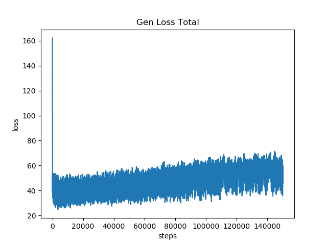
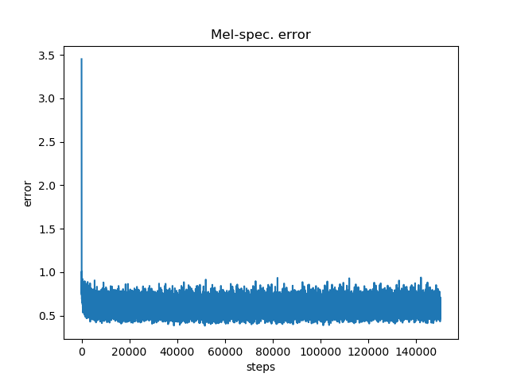
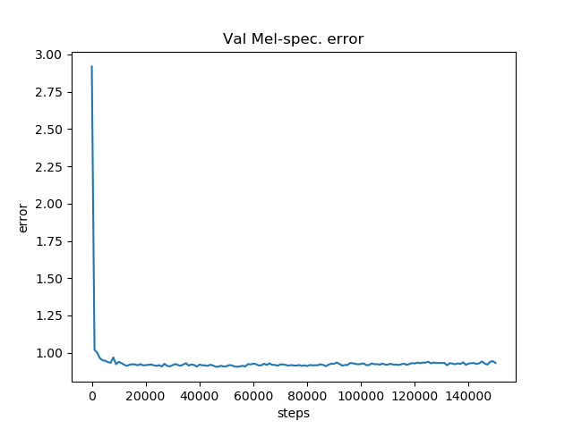

# HiFi-GAN LaughNet: an implementation of Luong and Yamagishi's LaughNet (2021) for a masters thesis.

Luong and Yamagishi (2021) based [LaughNet](https://arxiv.org/abs/2110.04946) on the [HiFi-GAN](https://arxiv.org/abs/2010.05646) speech synthesis model from Kong, Kim, and Bae (2020).<br/>
The major change they applied was the substitution of spectrograms for [waveform-silhouettes](https://github.com/nii-yamagishilab/waveform-silhouette-module).<br/>
For my masters thesis I have implemented this change so I could use LaughNet to synthesise my own laughter samples to perform research with.

### Abstract:

**Purpose:** The purpose of this research was to enhance the naturalness of synthesised speech by incorporating authentic laughter data into the laughter synthesis process of the state-of-the-art model LaughNet (Luong & Yamagishi, 2021b).

**Method:** A Support Vector Machine (SVM) was trained to classify acted and spontaneous human laughter based on their acoustic features to confirm the differences between them at the acoustic level. Factor analysis was applied to identify the most relevant acoustic features in determining authenticity. Then the influence of the synthesis procedure of LaughNet on these features was researched by examining the waveform silhouette format and by generating synthetic laughter using LaughNet, classifying it with the SVM, and comparing the classification performance to that of human laughter. The ability of human listeners to recognise the difference between human and synthetic laughter was evaluated using a listening test.

**Results:** The results of this study show that acted and spontaneous laughter can be distinguished on the basis of their acoustic features. The most relevant acoustic features are: 1) the F0 mean, maximum, and variability, 2) the percentage of unvoiced segments and the intensity, and 3) the F0 minimum. Out of these factors, only the second one is captured in the waveform silhouette. The other factors have to be regenerated by the model for the synthetic laughter. This could not be confirmed through synthesis and classification, since I was unable to get sufficiently usable output from LaughNet. Consequently, synthetic laughter could not be evaluated. Human listeners were able to detect the authenticity of human laughter significantly above chance level, with female laughter being easier to classify than male laughter. However, the authenticity judgements were not generally agreed upon.

**Conclusion:** The authenticity of laughter data appears to be irrelevant for the synthesis of natural laughter using LaughNet, as the model generates the most important lower-level acoustic features. However, there is a lack of authentic laughter data for training the model. Future research with sufficient lab-collected data may be able to overcome this limitation by carefully selecting the generative model, data format, and training- and fine-tuning data. Moreover, the perceived authenticity of isolated laughter appears to be contentious, suggesting the need for context to be taken into account in experimental designs as a way to disambiguate the authenticity judgments.


## Pre-requisites
1. Python >= 3.9.5
2. Clone this repository.
3. Clone the [vctk-silence-labels](https://github.com/nii-yamagishilab/vctk-silence-labels) repository inside your clone of this repository.
4. Install the Python requirements from [requirements.txt](requirements.txt)
5. Download the [VCTK dataset](https://datashare.ed.ac.uk/handle/10283/3443) and extract the VCTK-Corpus-0.92.zip folder in your clone of this repository.
6. Download a laughter dataset, such as the [Laughs SFX package](https://assetstore.unity.com/packages/audio/sound-fx/voices/laughs-sfx-111509), or use your own laughter data and upload it to and extract it in your clone of this repository.

## Preprocessing
1. Preprocess VCTK for training using the following command:
	```
	python preprocessing.py --data VCTK
	```
2. Preprocess the source laughter for finetuning using the following command:
	```
	python preprocessing.py --data laughter
	```

## Training
Train the model using the following command:
```
python train.py --config config_v1.json --input_wavs_dir VCTK-0.92/wavs --input_training_file VCTK-0.92/training.txt --input_validation_file VCTK-0.92/validation.txt
```

Checkpoints and copy of the configuration file are saved in `cp_hifigan` directory by default.<br>
You can change the path by adding `--checkpoint_path` option.

### Performance
The General loss total looks as follows:  

General loss total during training with V1 generator.<br>


The rising trend in the General loss total is not surprising given the lossy format of the min-max nature of the waveform-silhouette compared to the original mel-spectrogram.
Hence we should take a look at the Mel-spectrogram error:

Mel-spectrogram error during training with V1 generator.<br>


The Mel-spectrogram error decreases normally and then stabilises, but at least it's not getting worse.
To ensure that it is performing well we should also check the validation Mel-spectrogram error:

Validation mel-spectrogram error during training with V1 generator.<br>


Here too the error doesn't seem to improve that much, but at least it's not getting worse either, hence it should be fine.

## Fine-Tuning
1. Copy the filename of the source laughter file you want to finetune on from the `training-ft.txt` file in the `laughter/output` directory to the `validation-ft.txt` file. Be sure to include the `|` token!
2. Extract waveform silhouettes from all the source laughter in numpy format using the following command:
    ```
    python extract_ws_tensors.py
    ```
3. Fine-tune on the source laughter using the following command: 
    ```
    python train.py --fine_tuning True --config config_v1.json --input_wavs_dir laughter/output --input_training_file laughter/output/training-ft.txt --input_validation_file laughter/output/validation_ft.txt --checkpoint_interval 5000 --training_epochs 50055
    ```

For other command line options, please refer to the training section.

## Inference
1. Make a `test_files` directory and copy the target laughter wav files into the directory.
2. Run the following command.
    ```
    python inference.py --checkpoint_file [generator checkpoint file path]
    ```
Generated wav files are saved in `generated_files` by default.<br>
You can change the path by adding `--output_dir` option.

## Final Note
The current settings yield unsatisfactory results. This is likely caused by the fact that, due to a lack of available memory, I was only able to use segments of 3.75 seconds and a batch size of 8 (See [config_v1.json](./config_v1.json)), compared to the 6 second segments and batch size of 16 used by Luong and Yamagishi (2021).
Consequently, this implementation had significantly less data to work with than the model of Luong and Yamagishi (2021).

## Acknowledgements
I referred to [LaughNet](https://arxiv.org/abs/2110.04946), [HiFi-GAN](https://arxiv.org/abs/2010.05646),
and [vctk-silence-labels](https://github.com/nii-yamagishilab/vctk-silence-labels) to implement this.
