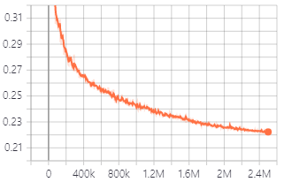

# HiFi-GAN: Generative Adversarial Networks for Efficient and High Fidelity Speech Synthesis

### Jungil Kong, Jaehyeon Kim, Jaekyoung Bae

In our [paper](https://arxiv.org/abs/2010.05646), 
we proposed HiFi-GAN: a GAN-based model capable of generating high fidelity speech efficiently.<br/>
We provide our implementation and pretrained models as open source in this repository.

**Abstract :**
Several recent work on speech synthesis have employed generative adversarial networks (GANs) to produce raw waveforms. 
Although such methods improve the sampling efficiency and memory usage, 
their sample quality has not yet reached that of autoregressive and flow-based generative models. 
In this work, we propose HiFi-GAN, which achieves both efficient and high-fidelity speech synthesis. 
As speech audio consists of sinusoidal signals with various periods, 
we demonstrate that modeling periodic patterns of an audio is crucial for enhancing sample quality. 
A subjective human evaluation (mean opinion score, MOS) of a single speaker dataset indicates that our proposed method 
demonstrates similarity to human quality while generating 22.05 kHz high-fidelity audio 167.9 times faster than 
real-time on a single V100 GPU. We further show the generality of HiFi-GAN to the mel-spectrogram inversion of unseen 
speakers and end-to-end speech synthesis. Finally, a small footprint version of HiFi-GAN generates samples 13.4 times 
faster than real-time on CPU with comparable quality to an autoregressive counterpart.

Visit our [demo website](https://jik876.github.io/hifi-gan-demo/) for audio samples.


## Pre-requisites
1. Python >= 3.9.5
2. Clone this repository.
3. Install python requirements. Please refer [requirements.txt](requirements.txt)
4. Download and extract the [VCTK dataset](https://datashare.ed.ac.uk/handle/10283/3443).

## Preprocessing
```
python preprocessing.py
```

## Training
```
python train.py --config config_v1.json
```
To train V2 or V3 Generator, replace `config_v1.json` with `config_v2.json` or `config_v3.json`.<br>
Checkpoints and copy of the configuration file are saved in `cp_hifigan` directory by default.<br>
You can change the path by adding `--checkpoint_path` option.

-------------------------------------------------------------------------------------------------------------------------------
Below will be updated later:


Validation loss during training with V1 generator.<br>


## Fine-Tuning
1. Generate mel-spectrograms in numpy format using [Tacotron2](https://github.com/NVIDIA/tacotron2) with teacher-forcing.<br/>
The file name of the generated mel-spectrogram should match the audio file and the extension should be `.npy`.<br/>
Example:
    ```
    Audio File : LJ001-0001.wav
    Mel-Spectrogram File : LJ001-0001.npy
    ```
2. Create `ft_dataset` folder and copy the generated mel-spectrogram files into it.<br/>
3. Run the following command.
    ```
    python train.py --fine_tuning True --config config_v1.json
    ```
    For other command line options, please refer to the training section.


## Inference from wav file
1. Make `test_files` directory and copy wav files into the directory.
2. Run the following command.
    ```
    python inference.py --checkpoint_file [generator checkpoint file path]
    ```
Generated wav files are saved in `generated_files` by default.<br>
You can change the path by adding `--output_dir` option.


## Inference for end-to-end speech synthesis
1. Make `test_mel_files` directory and copy generated mel-spectrogram files into the directory.<br>
You can generate mel-spectrograms using [Tacotron2](https://github.com/NVIDIA/tacotron2), 
[Glow-TTS](https://github.com/jaywalnut310/glow-tts) and so forth.
2. Run the following command.
    ```
    python inference_e2e.py --checkpoint_file [generator checkpoint file path]
    ```
Generated wav files are saved in `generated_files_from_mel` by default.<br>
You can change the path by adding `--output_dir` option.


## Acknowledgements
We referred to [WaveGlow](https://github.com/NVIDIA/waveglow), [MelGAN](https://github.com/descriptinc/melgan-neurips) 
and [Tacotron2](https://github.com/NVIDIA/tacotron2) to implement this.

